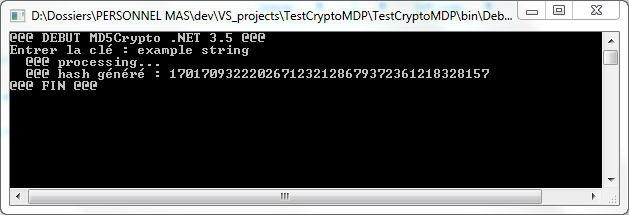

# TestCryptoMDP
Simple tool to check .Net encryption capabilities (System.Security.Cryptography).

Developped to analyse .Net error message when FIPS algorithm policy was turned off :
"*Cette implémentation ne fait pas partie des algorithmes de chiffrement validés FIPS pour les plateformes Windows.*"

[Okay, but what is FIPS ?](https://support.microsoft.com/en-us/help/811833/-system-cryptography-use-fips-compliant-algorithms-for-encryption--has)

Those two registry keys are involved in the FIPS activation :
```
HKEY_LOCAL_MACHINE\SYSTEM\CurrentControlSet\Control\Lsa\FipsAlgorithmPolicy
name : Enabled
```
and
```
HKEY_LOCAL_MACHINE\SYSTEM\CurrentControlSet\Control\Lsa\
name : fipsalgorithmpolicy
```

When activated, the program outputs this : 


